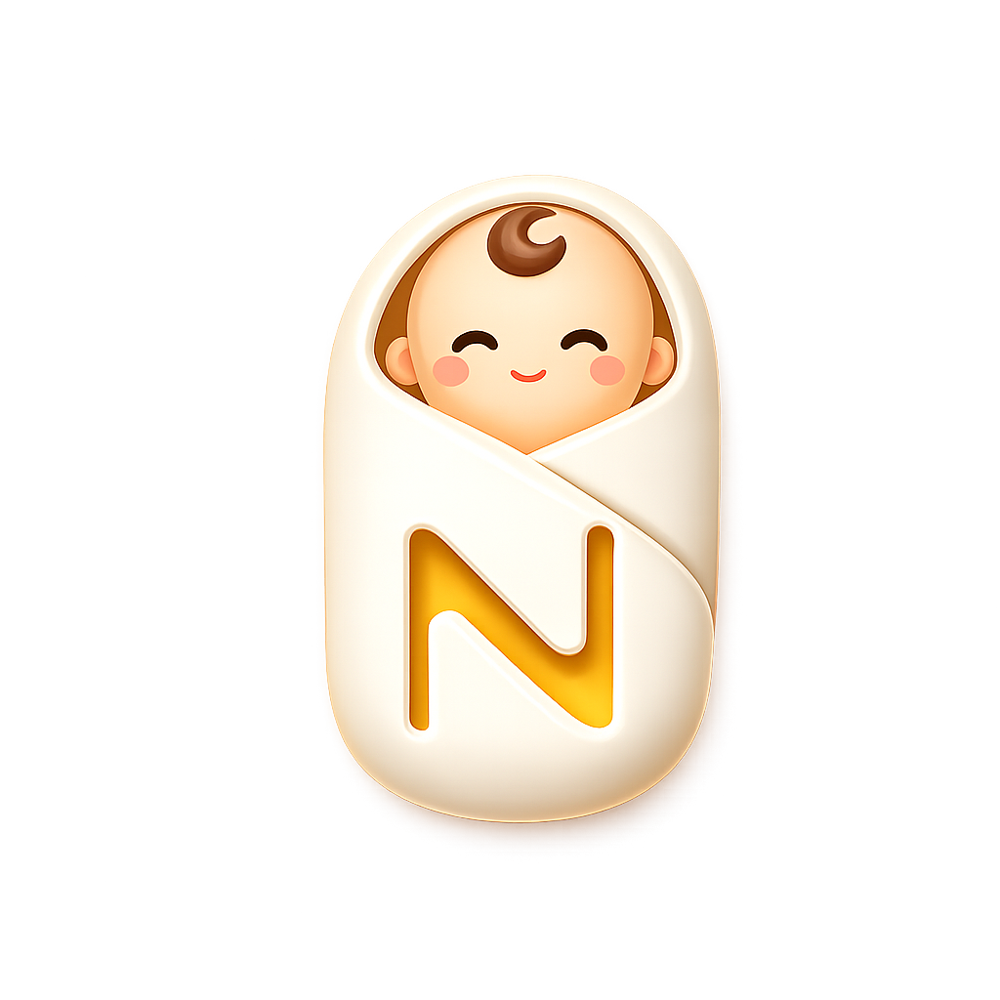
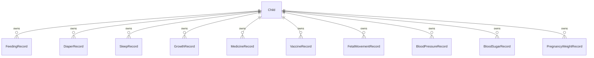

# Nura

<p align="center">
  
</p>

<h3 align="center">从孕期到成长，一本温柔、清晰、可回顾的家庭健康手账。</h3>

<p align="center">
  
  
  
  
  
</p>

<p align="center">
  
</p>

## 为什么是 Nura

Nura 是一款面向准妈妈和家庭的 iOS 记录应用。它不是简单的「宝宝记事本」，而是会根据档案自动判断当前阶段，并把界面、记录项和回顾方式切换到最需要的位置。

- 孕期：关注孕周、胎动、血压、血糖、孕期体重、产检提醒和 SOS 联系人。
- 婴儿：关注喂养、睡眠、尿布、黄疸、疫苗、体温和呼吸。
- 儿童：关注成长曲线、睡眠、健康记录、用药和疫苗提醒。
- 回顾：用图表、趋势和报告图，把零散记录变成直观总结。

## 产品亮点

| 场景 | Nura 做了什么 |
| --- | --- |
| 孕期记录 | 预产期自动计算孕周；展示胎儿大小、当周/下周产检项目；支持胎动计时、血压、血糖、体重记录 |
| 已生产归档 | 点击「生了宝宝」只记录生产日期，不强制创建宝宝档案；孕期档案保留为生产纪念和历史回顾 |
| 婴儿照护 | 喂养、睡眠、尿布、黄疸、体温、呼吸等高频记录快速录入 |
| 儿童成长 | 生长记录、睡眠和健康趋势持续追踪 |
| 疫苗提醒 | 内置基础疫苗计划，结合已接种记录判断下一针、即将到期和逾期 |
| 用药历史 | 用药记录按天归档，方便复盘某一天吃了什么、吃了多少 |
| 分享报告 | 回顾页可生成美观报告图，用 `ImageRenderer` 输出分享 |

## 功能预览

### 分阶段首页

Nura 会读取档案类型和年龄，自动切换不同的首页内容。

```swift
extension Child {
    var careStage: CareStage {
        if profileType == .pregnancy { return .pregnancy }
        return ageInDays < 365 ? .infant : .child
    }

    var hasDelivered: Bool {
        profileType == .pregnancy && deliveryDate != nil
    }
}
```

### 孕期专项记录

孕期不是只看倒计时。Nura 把常用记录拆成独立 SwiftData 模型，后续可以单独做趋势、回顾和报告。

```swift
@Model
final class FetalMovementRecord {
    @Attribute(.unique) var id: UUID
    var timestamp: Date
    var count: Int
    var durationMinutes: Int
    var actualSeconds: Int
    var child: Child?
}

@Model
final class BloodPressureRecord {
    @Attribute(.unique) var id: UUID
    var timestamp: Date
    var systolic: Int
    var diastolic: Int
    var child: Child?
}
```

### 可配置的阶段功能

每个阶段拥有自己的快速记录入口，避免把所有功能堆在一个页面里。

```swift
enum CareStage {
    case pregnancy
    case infant
    case child

    var logTypes: [NuraLogType] {
        switch self {
        case .pregnancy:
            return [.fetalMovement, .bloodPressure, .bloodSugar, .pregnancyWeight, .temperature, .medicine]
        case .infant:
            return [.feeding, .diaper, .sleep, .jaundice, .growth, .vaccine, .medicine, .temperature, .breathing]
        case .child:
            return [.growth, .sleep, .vaccine, .medicine, .temperature, .breathing]
        }
    }
}
```

### 疫苗提醒逻辑

疫苗计划使用静态排期表，实际接种数据使用 SwiftData 持久化。提醒状态由计划日期和接种记录共同决定。

```swift
struct VaccineReminderItem: Identifiable {
    let schedule: VaccineScheduleItem
    let record: VaccineRecord?
    let dueDate: Date

    var status: VaccineRecord.Status {
        if record?.isCompleted == true { return .done }
        if daysUntilDue < 0 { return .overdue }
        if daysUntilDue <= 14 { return .soon }
        return .upcoming
    }
}
```

### 报告图生成

回顾页会把 SwiftUI 视图渲染为图片，再交给系统分享面板。

```swift
@MainActor
private func generateReportImage() {
    let report = NuraReportSnapshotView(...)
        .frame(width: 390)

    let renderer = ImageRenderer(content: report)
    renderer.scale = 3
    shareImage = renderer.uiImage
    showShareSheet = shareImage != nil
}
```

## 技术栈

- SwiftUI：声明式界面、状态驱动交互、原生动画。
- SwiftData：本地优先的数据持久化，使用 `@Model` 和关系级联删除。
- Swift Charts：喂养、睡眠、尿布、体温、呼吸等趋势图表。
- UIKit Bridge：通过 `UIActivityViewController` 调起系统分享。
- SF Symbols：统一的图标语言，减少额外图片依赖。

## 项目结构

```text
Nura/
├── App/
│   ├── NuraApp.swift                 # App 入口、SwiftData modelContainer、欢迎流程
│   └── GrowthReportView.swift        # 成长报告相关视图
├── Models/
│   ├── Child.swift                   # 档案模型：孕妇/宝宝、阶段判断、生产日期
│   ├── CareStage.swift               # 孕期/婴儿/儿童功能配置
│   ├── PregnancyRecords.swift        # 胎动、血压、血糖、孕期体重
│   ├── VaccineRecord.swift           # 疫苗计划、记录和提醒状态
│   ├── FeedingRecord.swift           # 喂养记录
│   ├── DiaperRecord.swift            # 尿布记录
│   ├── SleepRecord.swift             # 睡眠记录
│   ├── GrowthRecord.swift            # 生长记录
│   └── DataManager.swift             # 数据清理/重置工具
├── Views/
│   ├── TodayView.swift               # 今日页、快速记录、孕期/婴儿/儿童卡片
│   ├── ReviewView.swift              # 回顾页、图表、报告分享、历史记录
│   ├── ChildSwitcherView.swift       # 档案切换、新增、编辑、删除
│   └── AnimatedLaunchScreenView.swift# 开屏动画
├── Theme/
│   └── Theme.swift                   # 颜色、字体、卡片样式、通用扩展
└── Assets.xcassets/
    ├── AppIcon.appiconset/
    └── LaunchImage.launchimage/
```

## 数据模型概览



## 设计语言

Nura 的界面尽量保持「轻、柔、明确」：

- 圆角卡片承载记录和趋势。
- 粉色用于孕期，紫色用于婴儿核心记录，蓝色用于儿童成长。
- 高风险健康状态使用红/橙色提醒，正常状态尽量克制。
- 记录入口使用图标+短标题，减少页面阅读压力。

## 运行项目

### 环境要求

- Xcode 17 或更新版本
- iOS Simulator / iOS 设备目标：当前工程配置为 iOS 26.2+
- macOS 开发环境

### 本地运行

```bash
git clone https://github.com/AustinLuke00/Nura.git
cd Nura
open Nura.xcodeproj
```

在 Xcode 中选择 `Nura` scheme 和目标模拟器，然后运行。

也可以用命令行构建：

```bash
xcodebuild \
  -project Nura.xcodeproj \
  -scheme Nura \
  -configuration Debug \
  -destination 'generic/platform=iOS Simulator' \
  build
```

## 路线图

- [ ] 本地通知：疫苗、产检、用药提醒。
- [ ] iCloud 同步：多设备共享家庭记录。
- [ ] 小组件：今日重点和下一针提醒。
- [ ] PDF/长图导出：更完整的阶段报告。
- [ ] iPad 适配：更适合长期回顾和图表查看。
- [ ] 数据备份：JSON/CSV 导出。

## 贡献

欢迎提交 Issue、Pull Request 或产品建议。适合贡献的方向：

- 新的孕期/儿童健康指标。
- 更细致的疫苗计划配置。
- 趋势图和报告图样式优化。
- 可访问性、暗色模式和 iPad 布局优化。

## License

Nura is available under the MIT license. See [LICENSE](LICENSE) for more info.

---

<p align="center"><strong>Nura</strong> · 记录不是负担，而是把重要的日子稳稳接住。</p>
